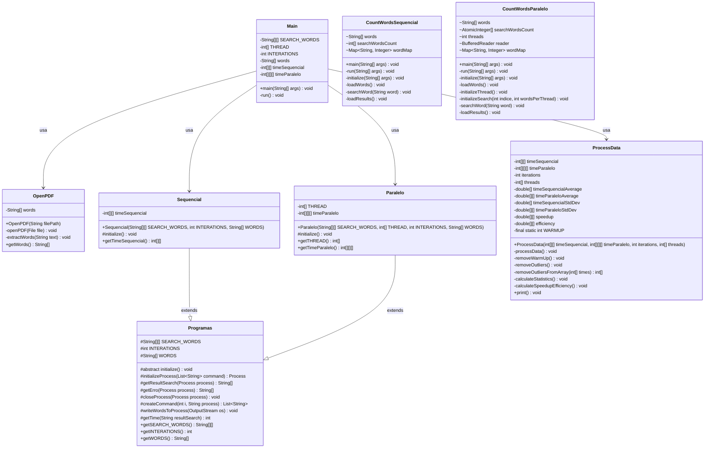

# Análise de Desempenho: Contagem de Palavras em Java com Abordagens Sequencial e Paralela

## 📚 Contexto da Atividade

Este projeto foi desenvolvido como parte da disciplina "Sistemas Paralelos e Distribuídos" do Instituto Federal de Educação, Ciência e Tecnologia do Sudeste de Minas Gerais, Campus Rio Pomba. A atividade propõe a implementação e análise comparativa entre algoritmos sequenciais e paralelos para contagem de palavras em um texto literário.

### O Projeto Gutenberg

O texto utilizado para análise provém do Projeto Gutenberg, que disponibiliza mais de 60.000 e-books gratuitos de domínio público. A obra escolhida foi "Clarissa Harlowe; or the history of a young lady" de Samuel Richardson, considerada um dos livros mais longos já escritos em língua inglesa.

## 🎯 Objetivos do Projeto

- Comparar desempenho entre duas abordagens de contagem de palavras:
  - Implementação **sequencial**
  - Implementação **paralela com múltiplas threads**

- Desenvolver um benchmark que:
  - Execute ambas as abordagens repetidamente
  - Meça e registre os tempos de execução
  - Produza dados confiáveis para análise estatística e comparação

- Analisar os **ganhos de desempenho (speedup)** e a **eficiência** do paralelismo

## 🏗️ Arquitetura do Sistema

O sistema está estruturado em três módulos principais:

### 1. Módulo Initialize
Responsável pela coordenação geral do benchmark, incluindo:
- Leitura do arquivo PDF
- Extração das palavras
- Execução das estratégias sequencial e paralela
- Coleta dos tempos de execução
- Processamento estatístico dos dados

### 2. Módulo Sequencial
Implementa a estratégia de contagem sequencial:
- Recebe as palavras a serem contadas como argumentos
- Processa o texto palavra por palavra em tempo real, sem armazenamento em memória
- Contabiliza as ocorrências de cada palavra alvo

### 3. Módulo Paralelo
Implementa a estratégia de contagem com paralelismo:
- Carrega todas as palavras em um array em memória antes do processamento
- Divide o processamento entre múltiplas threads
- Utiliza estruturas thread-safe para contabilização concorrente
- Permite parametrização do número de threads

## 📊 Diagrama de Classes



## 💻 Metodologia de Benchmark

O sistema realiza os seguintes experimentos:

1. **Programa A (Sequencial)**:
   - 30 execuções

2. **Programa B (Paralelo)** com três configurações:
   - 30 execuções com 2 threads
   - 30 execuções com 4 threads
   - 30 execuções com 8 threads

Para garantir medições estatisticamente relevantes, o sistema:
- Remove as primeiras execuções (warm-up)
- Elimina outliers usando o método de intervalo interquartil (IQR)
- Calcula média, desvio padrão, speedup e eficiência

Dois conjuntos de palavras foram testados:
1. Palavras frequentes: "clarissa", "letter", "lovelace", "virtue", "dear", "miss"
2. Palavras raras: "eita", "bacana", "vixe", "forbidden", "indignation", "oppression"

## 📈 Resultados de Performance

### Conjunto de Palavras Frequentes

```
============================================== RESULTADOS DE PERFORMANCE ===============================================
🔍 CONJUNTO DE PALAVRAS 1
│ SEQUENCIAL    │ Tempo médio:    64,37 ms │ Desvio padrão:     0,69 ms │
├───────────────┼─────────────────────────┼──────────────────────────┼───────────────────┼──────────────────────────────┤
│   PARALELO    │       TEMPO MÉDIO       │      DESVIO PADRÃO       │      SPEEDUP      │          EFICIÊNCIA          │
├───────────────┼─────────────────────────┼──────────────────────────┼───────────────────┼──────────────────────────────┤
│  2 Threads    │    99,25 ms             │     0,97 ms              │   0,65x           │   32,43%                     │
│  4 Threads    │   103,93 ms             │     1,80 ms              │   0,62x           │   15,48%                     │
│  8 Threads    │   111,81 ms             │     2,88 ms              │   0,58x           │    7,20%                     │
└───────────────┴─────────────────────────┴──────────────────────────┴───────────────────┴──────────────────────────────┘
```

### Conjunto de Palavras Raras

```
🔍 CONJUNTO DE PALAVRAS 2
│ SEQUENCIAL    │ Tempo médio:    64,00 ms │ Desvio padrão:     0,00 ms │
├───────────────┼─────────────────────────┼──────────────────────────┼───────────────────┼──────────────────────────────┤
│   PARALELO    │       TEMPO MÉDIO       │      DESVIO PADRÃO       │      SPEEDUP      │          EFICIÊNCIA          │
├───────────────┼─────────────────────────┼──────────────────────────┼───────────────────┼──────────────────────────────┤
│  2 Threads    │    98,64 ms             │     1,13 ms              │   0,65x           │   32,44%                     │
│  4 Threads    │   103,25 ms             │     1,46 ms              │   0,62x           │   15,50%                     │
│  8 Threads    │   116,68 ms             │     6,66 ms              │   0,55x           │    6,86%                     │
└───────────────┴─────────────────────────┴──────────────────────────┴───────────────────┴──────────────────────────────┘
=======================================================================================================================
```

## 🔍 Análise e Discussão dos Resultados

### Por que a versão sequencial foi mais rápida?

Contrariamente ao esperado, nossa implementação sequencial superou significativamente a versão paralela em todos os casos. O speedup foi consistentemente menor que 1 (0,55x a 0,65x), indicando uma degradação de desempenho na versão paralela. Este resultado surpreendente pode ser explicado por vários fatores:

1. **Diferença fundamental na manipulação de dados**: 
   - A versão sequencial processa cada palavra em streaming (uma por vez), sem armazenar o texto completo em memória
   - A versão paralela carrega todo o array de palavras antes de iniciar o processamento
   
2. **Sobrecarga de gerenciamento de threads**: 
   - Criar, inicializar e sincronizar threads tem um custo computacional significativo
   - A comunicação entre threads e o gerenciamento de memória compartilhada introduz latência

3. **Contenção de recursos**: 
   - As estruturas thread-safe (`AtomicInteger`) usadas para contagem concorrente introduzem overhead
   - A sincronização necessária para garantir a integridade dos dados cria gargalos

4. **Uso de memória e localidade de cache**:
   - A versão sequencial tem melhor localidade de cache por processar dados sequencialmente
   - A versão paralela pode sofrer com invalidações de cache e aumentar a taxa de cache miss

5. **Complexidade do problema**:
   - A contagem de palavras é uma operação relativamente simples e rápida
   - O overhead do paralelismo supera os ganhos para operações computacionalmente leves

### Impacto do hardware utilizado

#### Hardware utilizado
- **Processador**: Apple Silicon M2 (8 núcleos - 4 de performance e 4 de eficiência)
- **Memória RAM**: 8GB RAM unificada
- **Armazenamento**: SSD interno

**Influência do hardware**: A arquitetura do M2 apresenta características particulares que podem amplificar os problemas da implementação paralela:

1. **Heterogeneidade de núcleos**: Os 4 núcleos de eficiência do M2 têm desempenho significativamente inferior aos núcleos de performance. Quando distribuímos threads igualmente, algumas podem executar em núcleos mais lentos.

2. **Escalonamento do sistema operacional**: O macOS pode não distribuir idealmente as threads entre os núcleos disponíveis.

3. **Memória unificada**: O compartilhamento de memória entre CPU e GPU pode introduzir custos adicionais de sincronização quando múltiplas threads acessam dados.

### Degradação de desempenho com mais threads

É notável que o desempenho piora progressivamente à medida que aumentamos o número de threads:
- 2 threads: ~0,65x speedup (pior que sequencial)
- 4 threads: ~0,62x speedup (ainda pior)
- 8 threads: ~0,55x speedup (o pior caso)

Isso sugere que:

1. **O overhead de comunicação cresce linearmente** com o número de threads
2. **A contenção de recursos aumenta** com mais threads competindo pelos mesmos dados
3. **Limitação do scheduler**: O sistema operacional pode não conseguir escalonar efetivamente tantas threads, especialmente considerando a arquitetura heterogênea do M2

### Comparação entre conjuntos de palavras

Os resultados são bastante consistentes entre os dois conjuntos de palavras, com diferenças mínimas:

- Para palavras frequentes: Speedup de 0,65x a 0,58x
- Para palavras raras: Speedup de 0,65x a 0,55x

Isso indica que a frequência das palavras tem pouco impacto no desempenho relativo, sugerindo que o gargalo está mais relacionado à arquitetura da solução do que aos padrões específicos dos dados.

## 🧠 Lições Aprendidas e Recomendações

### 1. Nem sempre mais é melhor

O paralelismo não é uma solução universal para melhorar o desempenho. Este projeto demonstra claramente que paralelizar tarefas simples pode piorar significativamente o desempenho devido ao overhead introduzido.

### 2. A importância da estratégia de I/O

A diferença fundamental entre as implementações não está apenas no paralelismo, mas na estratégia de manipulação de dados:
- O processamento de streaming (sequencial) evitou armazenar todo o conjunto de dados na memória
- A carga completa do array (paralelo) aumentou o uso de memória e possivelmente afetou o desempenho

### 3. Avalie a granularidade da tarefa

Para tarefas de baixa complexidade computacional como contagem de palavras, o overhead do paralelismo pode facilmente superar os ganhos. O paralelismo funciona melhor para:
- Operações computacionalmente intensivas
- Problemas facilmente divisíveis com pouca necessidade de comunicação
- Conjuntos de dados grandes onde o processamento por item é significativo

### 4. Recomendações para melhorar o desempenho paralelo

Se prosseguirmos com a abordagem paralela, poderíamos:

1. **Implementar processamento streaming também na versão paralela**
2. **Reduzir a granularidade da divisão** (chunks maiores por thread)
3. **Utilizar estruturas de dados mais eficientes**, como contadores locais por thread com sincronização apenas no final
4. **Explorar paralelismo em nível de tarefa** em vez de paralelismo de dados
5. **Adotar um ThreadPool** em vez de criar threads manualmente

## 🛠️ Tecnologias Utilizadas

- **Java**: Linguagem de programação principal
- **Apache PDFBox**: Biblioteca para leitura e extração de texto de arquivos PDF
- **Apache Commons Math**: Biblioteca para cálculos estatísticos (média, desvio padrão, percentis)
- **Lombok**: Biblioteca para redução de código boilerplate via anotações
- **Maven**: Gerenciamento de dependências e build

## 🚀 Como Executar

### Pré-requisitos
- Java JDK 11 ou superior
- Maven 3.6 ou superior

### Passos para execução

1. Clone o repositório:
```bash
git clone https://github.com/StephanyeCunto/Sistemas_Paralelos_Distribuidos.git
cd Atividade_Avaliativa
```

2. Compile os módulos:
```bash
# Módulo Sequencial
cd sequencial
mvn clean package
cd ..

# Módulo Paralelo
cd paralelo
mvn clean package
cd ..

# Módulo Initialize (benchmark)
cd initialize
mvn clean package
cd ..
```

3. Execute o benchmark:
```bash
cd initialize
java -jar target/initialize-1.0-SNAPSHOT.jar
```

4. Os resultados serão exibidos no console ao final da execução.

## 📝 Conclusões

Este projeto forneceu informações valiosas sobre os desafios da programação paralela, demonstrando que nem sempre a paralelização resulta em ganhos de desempenho. As principais conclusões são:

1. **O contexto importa**: Para operações simples como contagem de palavras, o overhead de gerenciamento de threads pode anular quaisquer ganhos de paralelismo.

2. **Estratégias de processamento de dados**: A diferença entre processamento streaming e carregamento completo em memória teve impacto significativo no desempenho.

3. **Mais threads nem sempre são melhores**: Adicionar mais threads consistentemente piorou o desempenho, evidenciando que o problema não foi a falta de paralelismo, mas sim o overhead associado.

4. **Hardware-específico**: A arquitetura heterogênea do M2 introduz complexidades adicionais para workloads paralelos que podem não estar presentes em CPUs tradicionais.

Este projeto reforça a importância de realizar benchmarks empíricos antes de optar por soluções paralelas e destaca que o paralelismo deve ser aplicado criteriosamente, considerando cuidadosamente a natureza do problema, o hardware disponível e os overheads associados.

## 📚 Referências

1. Herlihy, M., & Shavit, N. (2012). *The Art of Multiprocessor Programming, Revised Reprint*. Morgan Kaufmann.

2. Goetz, B., Peierls, T., Bloch, J., Bowbeer, J., Holmes, D., & Lea, D. (2006). *Java Concurrency in Practice*. Addison-Wesley Professional.

3. Patterson, D. A., & Hennessy, J. L. (2017). *Computer Organization and Design RISC-V Edition: The Hardware Software Interface*. Morgan Kaufmann.

4. Oracle. (2023). [Java Thread Documentation](https://docs.oracle.com/javase/tutorial/essential/concurrency/).

5. Project Gutenberg. (2023). [Clarissa Harlowe; or the history of a young lady](https://www.gutenberg.org/).

6. Amdahl, G. M. (1967). *Validity of the single processor approach to achieving large scale computing capabilities*. Proceedings of the April 18-20, 1967, spring joint computer conference (pp. 483-485).

7. McCool, M. D., Robison, A. D., & Reinders, J. (2012). *Structured Parallel Programming: Patterns for Efficient Computation*. Morgan Kaufmann.

8. Apache PDFBox. (2023). [Reading PDF Documents](https://pdfbox.apache.org/).

9. Apache Commons Math. (2023). [Statistics Documentation](https://commons.apache.org/proper/commons-math/).

## 📄 Licença

Este projeto está licenciado sob a [Licença MIT](LICENSE) - veja o arquivo LICENSE para detalhes.

---

<div align="center">
  <p>Desenvolvido com ❤️ para a disciplina de Sistemas Paralelos e Distribuídos</p>
  <p>Instituto Federal de Educação, Ciência e Tecnologia do Sudeste de Minas Gerais, Campus Rio Pomba</p>
</div>
