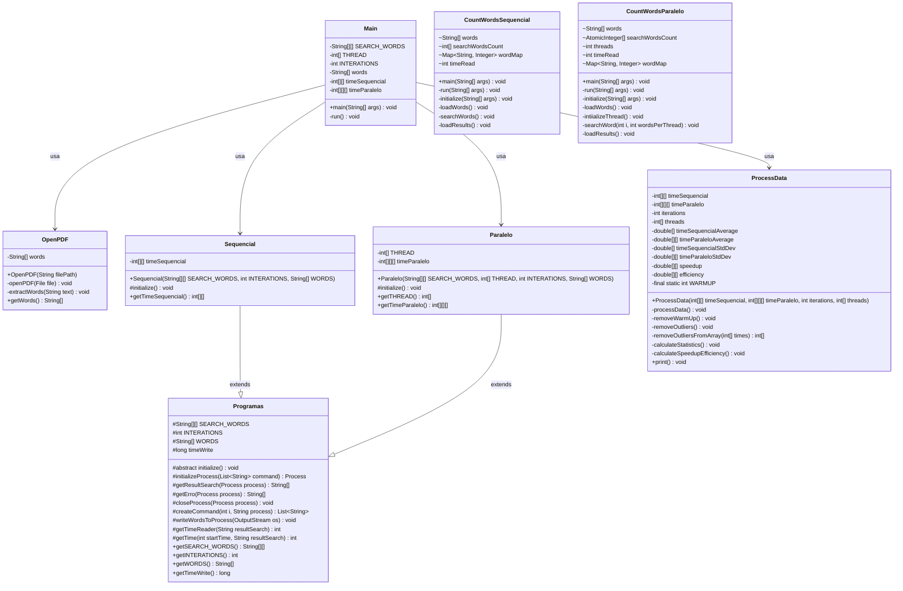

# Análise de Desempenho: Contagem de Palavras em Java com Abordagens Sequencial e Paralela

## 📚 Contexto da Atividade

Este projeto foi desenvolvido como parte da disciplina "Sistemas Paralelos e Distribuídos" do Instituto Federal de Educação, Ciência e Tecnologia do Sudeste de Minas Gerais, Campus Rio Pomba. A atividade propõe a implementação e análise comparativa entre algoritmos sequenciais e paralelos para contagem de palavras em um texto literário.

### O Projeto Gutenberg

O texto utilizado para análise provém do Projeto Gutenberg, que disponibiliza mais de 60.000 e-books gratuitos de domínio público. A obra escolhida foi "Clarissa Harlowe; or the history of a young lady" de Samuel Richardson, considerada um dos livros mais longos já escritos em língua inglesa.

## 🎯 Objetivos do Projeto

- Comparar desempenho entre duas abordagens de contagem de palavras:
  - Implementação **sequencial**
  - Implementação **paralela com múltiplas threads**

- Desenvolver um benchmark que:
  - Execute ambas as abordagens repetidamente
  - Meça e registre os tempos de execução
  - Produza dados confiáveis para análise estatística e comparação

- Analisar os **ganhos de desempenho (speedup)** e a **eficiência** do paralelismo

## 🏗️ Arquitetura do Sistema

O sistema está estruturado em três módulos principais:

### 1. Módulo Initialize
Responsável pela coordenação geral do benchmark, incluindo:
- Leitura do arquivo PDF
- Extração das palavras
- Execução das estratégias sequencial e paralela
- Coleta dos tempos de execução
- Processamento estatístico dos dados

### 2. Módulo Sequencial
Implementa a estratégia de contagem sequencial:
- Recebe as palavras a serem contadas como argumentos
- Processa o texto palavra por palavra
- Contabiliza as ocorrências de cada palavra alvo

### 3. Módulo Paralelo
Implementa a estratégia de contagem com paralelismo:
- Divide o processamento entre múltiplas threads
- Utiliza estruturas thread-safe para contabilização concorrente
- Permite parametrização do número de threads

## 📊 Diagrama de Classes



## 💻 Metodologia de Benchmark

O sistema realiza os seguintes experimentos:

1. **Programa A (Sequencial)**:
   - 30 execuções

2. **Programa B (Paralelo)** com três configurações:
   - 30 execuções com 2 threads
   - 30 execuções com 4 threads
   - 30 execuções com 8 threads

Para garantir medições estatisticamente relevantes, o sistema:
- Remove as primeiras execuções (warm-up)
- Elimina outliers usando o método de intervalo interquartil (IQR)
- Calcula média, desvio padrão, speedup e eficiência

Dois conjuntos de palavras foram testados:
1. Palavras frequentes: "clarissa", "letter", "lovelace", "virtue", "dear", "miss"
2. Palavras raras: "eita", "bacana", "vixe", "forbidden", "indignation", "oppression"

## 📈 Resultados de Performance

### Conjunto de Palavras Frequentes

```
============================================== RESULTADOS DE PERFORMANCE ===============================================
🔍 CONJUNTO DE PALAVRAS 1
│ SEQUENCIAL    │ Tempo médio:    52,36 ms │ Desvio padrão:     0,90 ms │
├───────────────┼─────────────────────────┼──────────────────────────┼───────────────────┼──────────────────────────────┤
│   PARALELO    │       TEMPO MÉDIO       │      DESVIO PADRÃO       │      SPEEDUP      │          EFICIÊNCIA          │
├───────────────┼─────────────────────────┼──────────────────────────┼───────────────────┼──────────────────────────────┤
│  2 Threads    │    48,77 ms             │     0,97 ms              │   1,07x           │   53,68%                     │
│  4 Threads    │    44,85 ms             │     4,68 ms              │   1,17x           │   29,19%                     │
│  8 Threads    │    51,71 ms             │     6,83 ms              │   1,01x           │   12,66%                     │
└───────────────┴─────────────────────────┴──────────────────────────┴───────────────────┴──────────────────────────────┘
```

### Conjunto de Palavras Raras

```
🔍 CONJUNTO DE PALAVRAS 2
│ SEQUENCIAL    │ Tempo médio:    53,30 ms │ Desvio padrão:     0,87 ms │
├───────────────┼─────────────────────────┼──────────────────────────┼───────────────────┼──────────────────────────────┤
│   PARALELO    │       TEMPO MÉDIO       │      DESVIO PADRÃO       │      SPEEDUP      │          EFICIÊNCIA          │
├───────────────┼─────────────────────────┼──────────────────────────┼───────────────────┼──────────────────────────────┤
│  2 Threads    │    48,57 ms             │     1,56 ms              │   1,10x           │   54,87%                     │
│  4 Threads    │    42,43 ms             │     5,85 ms              │   1,26x           │   31,40%                     │
│  8 Threads    │    47,58 ms             │     5,29 ms              │   1,12x           │   14,00%                     │
└───────────────┴─────────────────────────┴──────────────────────────┴───────────────────┴──────────────────────────────┘
=======================================================================================================================
```

## 🔍 Análise e Discussão dos Resultados

### Por que obtivemos esses resultados?

Os resultados demonstram que a paralelização trouxe ganhos moderados de desempenho, com o melhor speedup (1,26x) obtido com 4 threads para palavras raras. Este ganho limitado pode ser explicado por vários fatores:

1. **Overhead de criação e gerenciamento de threads**: O custo de criar, gerenciar e sincronizar threads pode ultrapassar os ganhos de paralelismo para tarefas relativamente simples como contagem de palavras
   
2. **Lei de Amdahl**: Mesmo com paralelização perfeita, existe uma porção sequencial no código (como leitura do arquivo e inicialização) que limita o ganho total de desempenho
   
3. **Disputa por recursos**: Com mais threads, aumenta a contenção por recursos compartilhados como memória cache e barramentos

4. **Tamanho do problema**: A contagem de palavras pode não ser um problema suficientemente complexo para que o paralelismo compense significativamente

A arquitetura do Apple M2 é significativamente diferente de processadores x86. O M2 utiliza uma configuração híbrida com 4 núcleos de alto desempenho e 4 núcleos de eficiência energética, o que pode resultar em comportamentos distintos em cargas paralelas:

1. **Heterogeneidade de núcleos**: O escalonador do sistema pode priorizar os núcleos de performance para threads com maior prioridade, resultando em desempenho assimétrico entre threads.

2. **Memória unificada**: A RAM compartilhada entre CPU e GPU no M2 oferece alta largura de banda mas com capacidade total limitada (8GB), possivelmente limitando ganhos em operações paralelas intensivas em memória.

3. **Pipeline de execução ARM**: A microarquitetura ARM do M2 possui características de execução distintas da arquitetura x86, o que pode alterar o equilíbrio entre processamento e I/O em nosso benchmark.

### Relação do speedup com fatores externos

#### Hardware utilizado
- **Processador**: Apple Silicon M2 (8 núcleos - 4 de performance e 4 de eficiência)
- **Memória RAM**: 8GB RAM unificada
- **Armazenamento**: SSD interno

**Influência**: O hardware tem influência significativa nos resultados. Com 8 threads físicas disponíveis, esperaríamos melhor desempenho para 8 threads lógicas, mas isso não ocorreu. Isso indica que outros fatores como cache, latência de memória e hardware de E/S podem estar limitando o desempenho.

#### Sistema Operacional
- **Sistema**: macOS 15.4.1
- **Java**: OpenJDK 23

**Influência**: O escalonador do sistema operacional afeta como as threads são distribuídas entre os núcleos. Sistemas operacionais diferentes têm políticas de escalonamento distintas, o que pode favorecer ou prejudicar aplicações paralelas.

#### Linguagem e recursos utilizados
- **Linguagem**: Java
- **Biblioteca de paralelismo**: Threads nativas do Java
- **Estruturas thread-safe**: AtomicInteger

**Influência**: Java tem overhead de JVM e garbage collection que podem afetar o desempenho paralelo. Comparado a linguagens de mais baixo nível como C/C++, o overhead pode ser maior. Contudo, a JVM também oferece otimizações como JIT que podem compensar parcialmente estas desvantagens.

#### Conjunto de dados
Os resultados mostram uma diferença de comportamento entre os conjuntos de palavras:
- Para palavras frequentes: Speedup máximo de 1.17x com 4 threads
- Para palavras raras: Speedup máximo de 1.26x com 4 threads

**Influência**: Palavras mais raras resultaram em speedup ligeiramente melhor, possivelmente porque:
1. Menos contenção ao atualizar contadores (menos colisões em AtomicIntegers)
2. Melhor localidade de cache quando as palavras são menos frequentes

#### Por que 4 threads tiveram melhor desempenho?
1. **Equilíbrio ótimo**: 4 threads proporcionaram o melhor equilíbrio entre paralelismo e overhead
2. **Arquitetura da CPU**: Se o processador tem 4 núcleos físicos ou um design com compartilhamento de cache L3 entre 4 núcleos, isso explicaria o pico em 4 threads
3. **Memory bandwidth**: O sistema pode ter atingido o limite de largura de banda de memória com 4 threads, tornando inútil adicionar mais

#### Onde foi possível aumentar a vazão?
1. **Divisão do trabalho**: A separação do texto em chunks para processamento paralelo foi eficiente
2. **AtomicInteger**: O uso de estruturas thread-safe permitiu contabilização concorrente sem locks pesados
3. **Processamento de palavras**: A etapa de busca de palavras no texto é onde o paralelismo trouxe mais benefícios

## 🛠️ Tecnologias Utilizadas

- **Java**: Linguagem de programação principal
- **Apache PDFBox**: Biblioteca para leitura e extração de texto de arquivos PDF
- **Apache Commons Math**: Biblioteca para cálculos estatísticos (média, desvio padrão, percentis)
- **Lombok**: Biblioteca para redução de código boilerplate via anotações
- **Maven**: Gerenciamento de dependências e build

## 🚀 Como Executar

### Pré-requisitos
- Java JDK 11 ou superior
- Maven 3.6 ou superior

### Passos para execução

1. Clone o repositório:
```bash
git clone https://github.com/StephanyeCunto/Sistemas_Paralelos_Distribuidos.git
cd Atividade_Avaliativa
```

2. Compile os módulos:
```bash
# Módulo Sequencial
cd sequencial
mvn clean package
cd ..

# Módulo Paralelo
cd paralelo
mvn clean package
cd ..

# Módulo Initialize (benchmark)
cd initialize
mvn clean package
cd ..
```

3. Execute o benchmark:
```bash
cd initialize
java -jar target/initialize-1.0-SNAPSHOT.jar
```

4. Os resultados serão exibidos no console ao final da execução.

## 📝 Conclusões

Este projeto demonstrou e quantificou os desafios e oportunidades da programação paralela aplicada ao problema específico de contagem de palavras. As principais conclusões são:

1. **Paralelismo nem sempre significa desempenho significativamente melhor**
   - O speedup máximo de 1,26x é modesto considerando o hardware utilizado
   - A Lei de Amdahl limita o ganho potencial devido às partes inerentemente sequenciais

2. **Existe um "ponto doce" para o número de threads**
   - 4 threads proporcionaram o melhor equilíbrio entre paralelismo e overhead
   - Adicionar mais threads além desse ponto piorou o desempenho

3. **A eficiência cai dramaticamente com o aumento de threads**
   - De ~54% com 2 threads para ~13% com 8 threads
   - Demonstra a importância de ajustar o paralelismo às características do problema

4. **Características dos dados afetam o desempenho**
   - Palavras raras permitiram melhor speedup que palavras frequentes
   - Sugere que padrões de acesso à memória e contenção afetam o paralelismo

5. **Estabilidade vs. Desempenho é um trade-off**
   - Implementações sequenciais mostram menor variabilidade
   - Implementações paralelas oferecem melhor desempenho médio, mas com maior variabilidade

Este projeto fornece insights valiosos sobre os fatores que influenciam o desempenho de programas paralelos, demonstrando a importância de uma abordagem empírica e baseada em dados para decisões de paralelização.

## 📚 Referências

1. Herlihy, M., & Shavit, N. (2012). *The Art of Multiprocessor Programming, Revised Reprint*. Morgan Kaufmann.

2. Goetz, B., Peierls, T., Bloch, J., Bowbeer, J., Holmes, D., & Lea, D. (2006). *Java Concurrency in Practice*. Addison-Wesley Professional.

3. Patterson, D. A., & Hennessy, J. L. (2017). *Computer Organization and Design RISC-V Edition: The Hardware Software Interface*. Morgan Kaufmann.

4. Oracle. (2023). [Java Thread Documentation](https://docs.oracle.com/javase/tutorial/essential/concurrency/).

5. Project Gutenberg. (2023). [Clarissa Harlowe; or the history of a young lady](https://www.gutenberg.org/).

6. Amdahl, G. M. (1967). *Validity of the single processor approach to achieving large scale computing capabilities*. Proceedings of the April 18-20, 1967, spring joint computer conference (pp. 483-485).

7. McCool, M. D., Robison, A. D., & Reinders, J. (2012). *Structured Parallel Programming: Patterns for Efficient Computation*. Morgan Kaufmann.

8. Apache PDFBox. (2023). [Reading PDF Documents](https://pdfbox.apache.org/).

9. Apache Commons Math. (2023). [Statistics Documentation](https://commons.apache.org/proper/commons-math/).

## 📄 Licença

Este projeto está licenciado sob a [Licença MIT](LICENSE) - veja o arquivo LICENSE para detalhes.

---

<div align="center">
  <p>Desenvolvido com ❤️ para a disciplina de Sistemas Paralelos e Distribuídos</p>
  <p>Instituto Federal de Educação, Ciência e Tecnologia do Sudeste de Minas Gerais, Campus Rio Pomba</p>
</div>
