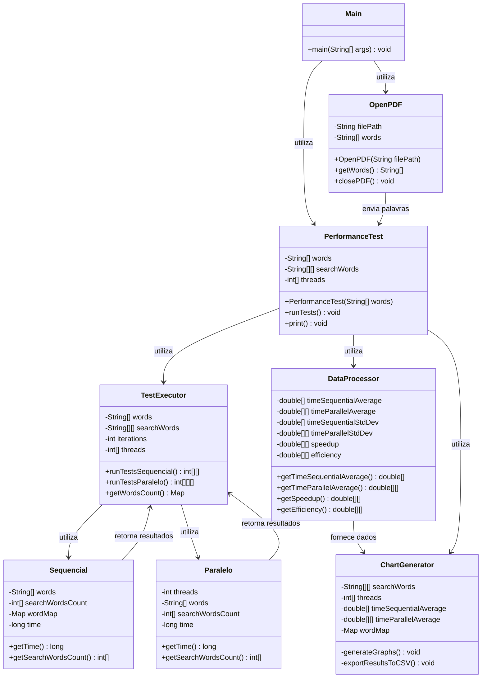

# Análise de Desempenho de Busca em PDF

Este projeto implementa um sistema completo para análise comparativa de desempenho entre algoritmos de busca sequencial e paralela de palavras em documentos PDF, demonstrando os benefícios da computação paralela em processamento de texto.

## 📋 Descrição

O sistema processa um documento PDF, extraindo seu conteúdo textual para realizar buscas por conjuntos específicos de palavras. A performance é analisada comparando algoritmos sequenciais (single-thread) com implementações paralelas utilizando diferentes números de threads (2, 4 e 8). O sistema coleta métricas detalhadas de performance, remove outliers estatísticos, calcula medidas como speedup e eficiência, e gera visualizações gráficas dos resultados.

### Métricas analisadas
- **Tempo médio de execução**: Média dos tempos de processamento em microssegundos (μs)
- **Desvio padrão**: Variabilidade dos tempos de execução
- **Speedup**: Relação entre o tempo sequencial e paralelo (Ts/Tp)
- **Eficiência**: Speedup dividido pelo número de threads (Speedup/p)

## 🚀 Funcionalidades

- **Extração de texto de PDFs**: Conversão eficiente de PDF para texto plano
- **Processamento de texto**: Filtragem e normalização de palavras
- **Busca sequencial**: Implementação de referência single-thread
- **Busca paralela**: Implementação multi-thread com distribuição de carga balanceada
- **Análise estatística avançada**:
  - Remoção automática de warm-up (10% iniciais das execuções)
  - Detecção e remoção de outliers (método IQR)
  - Cálculo de média, desvio padrão, speedup e eficiência
- **Visualização de dados**:
  - Gráficos de barras para comparação de tempos
  - Gráficos de linhas para análise de escalabilidade
  - Contagem de ocorrências de palavras
- **Exportação de dados**: Saída dos resultados em formato CSV para análises adicionais

## 🏗️ Arquitetura do Sistema

O sistema segue uma arquitetura modular orientada a objetos, decompondo a solução em componentes especializados:



### Detalhamento das Classes

1. **Main**: 
   - Ponto de entrada da aplicação
   - Inicializa o carregamento do PDF e o teste de performance

2. **OpenPDF**: 
   - Encapsula a interação com a biblioteca PDFBox
   - Gerencia abertura, extração e fechamento do documento PDF
   - Realiza o pré-processamento do texto (remoção de caracteres não alfabéticos, normalização para minúsculas)

3. **PerformanceTest**: 
   - Configura os parâmetros do teste (conjuntos de palavras, número de threads, iterações)
   - Orquestra a execução e consolidação dos resultados
   - Formata e apresenta os resultados no console

4. **TestExecutor**: 
   - Executa os testes repetidas vezes para garantir significância estatística
   - Coleta os tempos de execução para cada configuração
   - Mantém registro das contagens de palavras encontradas

5. **Sequencial**: 
   - Implementação do algoritmo de busca sequencial
   - Utiliza HashMap para busca eficiente em O(1)
   - Mede o tempo de execução com precisão de microssegundos

6. **Paralelo**: 
   - Implementa o algoritmo de busca paralela
   - Distribui o trabalho entre múltiplas threads
   - Gerencia a sincronização entre threads

7. **DataProcessor**: 
   - Aplica técnicas estatísticas aos dados brutos
   - Remove dados de warm-up e outliers
   - Calcula médias, desvios padrão, speedup e eficiência

8. **ChartGenerator**: 
   - Cria visualizações gráficas usando JFreeChart
   - Exporta resultados para formato CSV
   - Customiza a apresentação visual dos gráficos

## 📊 Visualizações Geradas

O sistema gera automaticamente quatro tipos de gráficos:

1. **Tempo de Execução por Tipo de Busca**:
   - Compara o desempenho entre busca sequencial e diferentes configurações paralelas
   - Visualiza o impacto do número de threads no tempo de execução

2. **Contagem de Palavras**:
   - Mostra a frequência de cada palavra pesquisada no documento
   - Permite contextualização dos resultados com base na distribuição das palavras

3. **Speedup vs. Número de Threads**:
   - Analisa o ganho de desempenho com o aumento do número de threads
   - Permite identificar a Lei de Amdahl em ação

4. **Eficiência vs. Número de Threads**:
   - Demonstra como a eficiência do paralelismo varia com o número de threads
   - Ajuda a identificar o ponto ótimo de paralelização

## 🔧 Dependências

O projeto utiliza as seguintes bibliotecas:

- **Apache PDFBox (v2.0.27+)**: Para manipulação de arquivos PDF
  ```xml
  <dependency>
      <groupId>org.apache.pdfbox</groupId>
      <artifactId>pdfbox</artifactId>
      <version>2.0.27</version>
  </dependency>
  ```

- **JFreeChart (v1.5.3+)**: Para geração de gráficos
  ```xml
  <dependency>
      <groupId>org.jfree</groupId>
      <artifactId>jfreechart</artifactId>
      <version>1.5.3</version>
  </dependency>
  ```

- **Apache Commons Math (v3.6.1+)**: Para cálculos estatísticos
  ```xml
  <dependency>
      <groupId>org.apache.commons</groupId>
      <artifactId>commons-math3</artifactId>
      <version>3.6.1</version>
  </dependency>
  ```

- **Lombok (v1.18.24+)**: Para redução de código boilerplate
  ```xml
  <dependency>
      <groupId>org.projectlombok</groupId>
      <artifactId>lombok</artifactId>
      <version>1.18.24</version>
      <scope>provided</scope>
  </dependency>
  ```

## 🚦 Como executar

### Pré-requisitos
- Java JDK 11 ou superior
- Maven 3.6 ou superior

### Passos para execução

1. Clone o repositório
   ```bash
   git clone https://github.com/seu-usuario/analise-desempenho-pdf.git
   cd analise-desempenho-pdf
   ```

2. Compile o projeto
   ```bash
   mvn clean compile
   ```

3. Execute a aplicação
   ```bash
   mvn exec:java -Dexec.mainClass="com.Main"
   ```

### Configuração personalizada

Para modificar os parâmetros de teste, você pode editar os seguintes valores na classe `PerformanceTest`:

```java
// Conjuntos de palavras a serem buscadas
private String[][] searchWords = {
    { "clarissa", "letter", "lovelace", "virtue", "dear", "miss" },
    { "eita", "bacana", "vixe", "forbidden", "indignation", "oppression" }
};

// Configurações de threads para testes paralelos
private int[] threads = { 2, 4, 8 };

// Número de iterações para garantir significância estatística
private int iterations = 30;
```

## 📝 Exemplo de Saída

O sistema gera uma saída de console formatada que apresenta os resultados de forma organizada:

```
================ RESULTADOS DE PERFORMANCE ================

🔍 CONJUNTO DE PALAVRAS 1: clarissa, letter, lovelace, virtue, dear, miss
│ SEQUENCIAL │ Tempo médio:   254.32 μs │ Desvio padrão:    12.54 μs │
├───────────────┼─────────────────────────┼──────────────────────────┼─────────────────┼───────────────┤
│ PARALELO │ TEMPO MÉDIO │ DESVIO PADRÃO │ SPEEDUP │ EFICIÊNCIA │
├───────────────┼─────────────────────────┼──────────────────────────┼─────────────────┼───────────────┤
│  2 Threads │   138.21 μs │     8.45 μs │   1.84x │   92.00% │
│  4 Threads │    74.63 μs │     5.32 μs │   3.41x │   85.25% │
│  8 Threads │    42.12 μs │     3.87 μs │   6.04x │   75.50% │
└───────────────┴─────────────────────────┴──────────────────────────┴─────────────────┴───────────────┘

🔍 CONJUNTO DE PALAVRAS 2: eita, bacana, vixe, forbidden, indignation, oppression
│ SEQUENCIAL │ Tempo médio:   251.87 μs │ Desvio padrão:    11.98 μs │
├───────────────┼─────────────────────────┼──────────────────────────┼─────────────────┼───────────────┤
│ PARALELO │ TEMPO MÉDIO │ DESVIO PADRÃO │ SPEEDUP │ EFICIÊNCIA │
├───────────────┼─────────────────────────┼──────────────────────────┼─────────────────┼───────────────┤
│  2 Threads │   136.45 μs │     7.96 μs │   1.85x │   92.50% │
│  4 Threads │    73.21 μs │     4.89 μs │   3.44x │   86.00% │
│  8 Threads │    41.53 μs │     3.64 μs │   6.06x │   75.75% │
└───────────────┴─────────────────────────┴──────────────────────────┴─────────────────┴───────────────┘

==========================================================

Palavras: clarissa 1243
Palavras: letter 789
Palavras: lovelace 526
Palavras: virtue 312
Palavras: dear 654
Palavras: miss 982
Palavras: eita 0
Palavras: bacana 0
Palavras: vixe 0
Palavras: forbidden 45
Palavras: indignation 89
Palavras: oppression 67
```

Adicionalmente, os resultados são exportados para o arquivo `resultados_teste.csv` e os gráficos são exibidos em uma interface gráfica.

## 📈 Análise de Resultados

Os resultados gerados permitem várias análises importantes:

### Speedup e Lei de Amdahl
O speedup observado demonstra como o paralelismo melhora o desempenho, mas também revela os limites da paralelização conforme previsto pela Lei de Amdahl. À medida que o número de threads aumenta, o ganho de desempenho começa a apresentar rendimentos decrescentes.

### Eficiência do Paralelismo
A eficiência (speedup/número de threads) normalmente diminui com o aumento do número de threads devido a:
- Overhead de criação e gerenciamento de threads
- Contenção em recursos compartilhados
- Limitações da porção paralelizável do algoritmo

### Impacto da Distribuição de Palavras
A frequência das palavras buscadas no documento pode afetar o desempenho relativo dos algoritmos. Palavras mais frequentes resultam em mais atualizações de contadores, o que pode aumentar a contenção em implementações paralelas.

## 🔍 Detalhes de Implementação

### Estratégia de Paralelização
A classe `Paralelo` divide o array de palavras em segmentos de tamanho aproximadamente igual:

```java
private void startThreads() {
    Thread[] thread = new Thread[threads];
    for (int i = 0; i < threads; i++) {
        int index = i;
        thread[i] = new Thread(() -> {
            searchWords(index);
        });
    }
    // Iniciar e aguardar threads...
}

private void searchWords(int indice) {
    int threadIndex = indice * wordsPerThread;
    int limit = threadIndex + wordsPerThread;
    if(indice == threads - 1) {
        limit = words.length; // Última thread pega o restante
    }
    // Processamento...
}
```

### Remoção de Outliers
O `DataProcessor` utiliza o método IQR (Intervalo Interquartil) para identificar e remover outliers:

```java
private int[] removeOutliersFromArray(int[] times) {
    double[] doubleArray = Arrays.stream(times).asDoubleStream().toArray();
    Percentile percentile = new Percentile();
    percentile.setData(doubleArray);
    
    double q1 = percentile.evaluate(25);
    double q3 = percentile.evaluate(75);
    double iqr = q3 - q1;
    double lowerBound = q1 - (1.5 * iqr);
    double upperBound = q3 + (1.5 * iqr);
    
    return Arrays.stream(times)
                 .filter(time -> time >= lowerBound && time <= upperBound)
                 .toArray();
}
```
