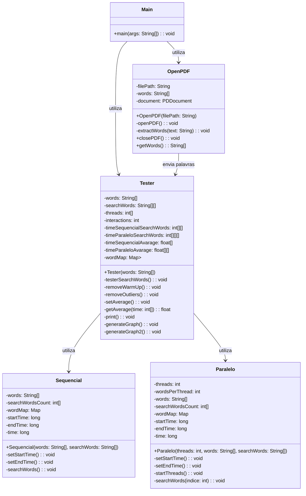

```mermaid
classDiagram
    class Main {
        +main(args: String[]): void
    }

    class OpenPDF {
        -filePath: String
        -words: String[]
        -document: PDDocument
        +OpenPDF(filePath: String)
        -openPDF(): void
        -extractWords(text: String): void
        +closePDF(): void
        +getWords(): String[]
    }

    class Paralelo {
        -threads: int
        -wordsPerThread: int
        -words: String[]
        -searchWordsCount: int[]
        -wordMap: Map<String, Integer>
        -startTime: long
        -endTime: long
        -time: long
        +Paralelo(threads: int, words: String[], searchWords: String[])
        -setStartTime(): void
        -setEndTime(): void
        -startThreads(): void
        -searchWords(indice: int): void
    }

    class Sequencial {
        -words: String[]
        -searchWordsCount: int[]
        -wordMap: Map<String, Integer>
        -startTime: long
        -endTime: long
        -time: long
        +Sequencial(words: String[], searchWords: String[])
        -setStartTime(): void
        -setEndTime(): void
        -searchWords(): void
    }

    class Tester {
        -words: String[]
        -searchWords: String[][]
        -threads: int[]
        -interactions: int
        -timeSequencialSearchWords: int[][]
        -timeParaleloSearchWords: int[][][]
        -timeSequencialAvarage: float[]
        -timeParaleloAvarage: float[][]
        -wordMap: Map<String, List<Integer>>
        +Tester(words: String[])
        -testerSearchWords(): void
        -removeWarmUp(): void
        -removeOutliers(): void
        -setAverage(): void
        -getAverage(time: int[]): float
        -print(): void
        -generateGraph(): void
        -generateGraph2(): void
    }

    Main --> OpenPDF : utiliza
    Main --> Tester : utiliza
    OpenPDF --> Tester : envia palavras
    Tester --> Sequencial : utiliza
    Tester --> Paralelo : utiliza
```
