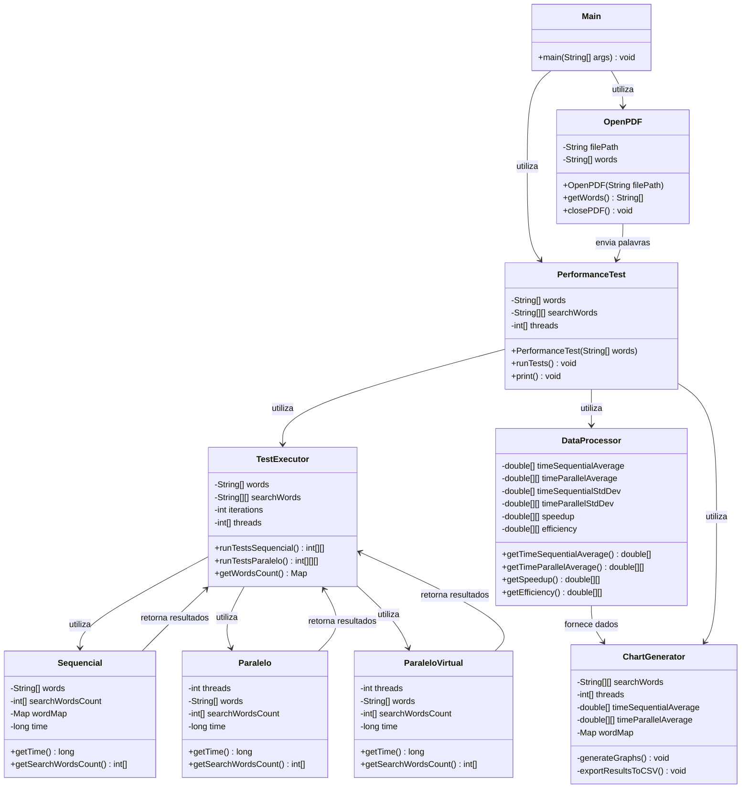

# Análise de Desempenho de Busca em PDF

Este projeto implementa um sistema completo para comparar o desempenho de algoritmos de busca sequencial e paralela em documentos PDF, demonstrando os benefícios da computação paralela e do uso de threads virtuais modernas em Java.


## 📋 Descrição

O sistema processa documentos PDF, extrai seu conteúdo textual e realiza buscas por conjuntos específicos de palavras. A análise de desempenho compara:

- Busca sequencial (single-thread)
- Busca paralela com 2, 4 e 8 threads tradicionais
- Busca paralela com 2, 4 e 8 **threads virtuais** (Java 19+)

São coletadas **métricas detalhadas de performance**, como tempo médio de execução, desvio padrão, speedup e eficiência, com visualizações gráficas automáticas.


### Métricas analisadas
- **Tempo médio de execução**: Média dos tempos de processamento em microssegundos (μs)
- **Dados de warm-up excluídos**: 10% iniciais das execuções
- **Outliers identificados e removidos**: Utilizando método IQR
- **Desvio padrão**: Variabilidade dos tempos de execução
- **Speedup**: Relação entre o tempo sequencial e paralelo (Ts/Tp)
- **Eficiência**: Speedup dividido pelo número de threads (Speedup/p)

## 🚀 Funcionalidades

- **Extração de texto de PDFs**: Conversão eficiente de PDF para texto plano
- **Processamento de texto**: Filtragem e normalização de palavras
- **Busca sequencial**: Implementação de referência single-thread
- **Busca paralela**: Implementação multi-thread com distribuição de carga balanceada, incluindo variações com threads tradicionais e threads virtuais para explorar maior escalabilidade e leveza na execução concorrente
- **Programa Testador (Benchmark)**: 
  - Executa 30 iterações de cada configuração
  - Registra todos os tempos brutos
  - Armazena dados de execução em arquivo CSV
- **Análise estatística avançada**:
  - Remoção automática de warm-up (10% iniciais das execuções)
  - Detecção e remoção de outliers (método IQR)
  - Cálculo de média, desvio padrão, speedup e eficiência
- **Visualização de dados**:
  - Gráficos de barras para comparação de tempos
  - Gráficos de linhas para análise de escalabilidade
  - Contagem de ocorrências de palavras
- **Exportação de dados**: Saída dos resultados em formato CSV para análises adicionais


## 🏗️ Arquitetura do Sistema

O sistema segue uma arquitetura modular orientada a objetos, decompondo a solução em componentes especializados:



### Detalhamento das Classes

1. **Main**: 
   - Ponto de entrada da aplicação
   - Inicializa o carregamento do PDF e o teste de performance

2. **OpenPDF**: 
   - Encapsula a interação com a biblioteca PDFBox
   - Gerencia abertura, extração e fechamento do documento PDF
   - Realiza o pré-processamento do texto (remoção de caracteres não alfabéticos, normalização para minúsculas)

3. **PerformanceTest**: 
   - Configura os parâmetros do teste (conjuntos de palavras, número de threads, iterações)
   - Orquestra a execução e consolidação dos resultados
   - Formata e apresenta os resultados no console

4. **TestExecutor**: 
   - Executa os 30 testes para cada configuração
   - Coleta e armazena os tempos brutos de execução
   - Salva dados brutos em arquivo para análise posterior
   - Mantém registro das contagens de palavras encontradas

5. **Sequencial**: 
   - Implementação do algoritmo de busca sequencial
   - Utiliza HashMap para busca eficiente em O(1)
   - Mede o tempo de execução com precisão de microssegundos

6. **Paralelo**: 
   - Implementa o algoritmo de busca paralela
   - Suporta configurações com 2, 4 e 8 threads
   - Distribui o trabalho de forma balanceada entre threads
   - Gerencia a sincronização entre threads
  
7. **ParaleloVirtual**: 
   - Implementa o algoritmo de busca paralela com **threads virtuais** (do Java moderno)
   - Suporta configurações com 2, 4 e 8 threads virtuais
   - Distribui o trabalho de forma balanceada entre threads virtuais
   - Gerencia a sincronização entre threads

8. **DataProcessor**: 
   - Aplica tratamento aos dados brutos:
     - Remove primeiras 3 execuções (10% de warm-up)
     - Identifica e remove outliers pelo método IQR
   - Calcula métricas solicitadas:
     - Tempo médio após filtragem
     - Desvio padrão
     - Speedup para cada configuração paralela
     - Eficiência

9. **ChartGenerator**: 
   - Cria visualizações gráficas usando JFreeChart
   - Exporta resultados para formato CSV
   - Customiza a apresentação visual dos gráficos

## 📊 Visualizações Geradas

### 1. Gráficos
O sistema gera automaticamente quatro tipos de gráficos:

1. **Tempo de Execução por Configuração**:
   - Compara o desempenho entre busca sequencial e diferentes configurações paralelas
   - Visualiza o impacto do número de threads no tempo de execução

2. **Contagem de Palavras**:
   - Mostra a frequência de cada palavra pesquisada no documento
   - Permite contextualização dos resultados com base na distribuição das palavras

3. **Speedup vs. Número de Threads**:
   - Analisa o ganho de desempenho com o aumento do número de threads
   - Permite identificar a Lei de Amdahl em ação

4. **Eficiência vs. Número de Threads**:
   - Demonstra como a eficiência do paralelismo varia com o número de threads
   - Ajuda a identificar o ponto ótimo de paralelização


### 2. Resultados no Console
O sistema apresenta um resumo formatado no console:
```
Palavras: bacana 0
Palavras: oppression 7
Palavras: clarissa 869
Palavras: indignation 69
Palavras: letter 3531
Palavras: vixe 0
Palavras: forbidden 17
Palavras: lovelace 2026
Palavras: virtue 283
Palavras: dear 1850
Palavras: eita 0
Palavras: miss 2293
============================================== RESULTADOS DE PERFORMANCE =======================================
🔍 CONJUNTO DE PALAVRAS 1: clarissa, letter, lovelace, virtue, dear, miss
│ SEQUENCIAL    │ Tempo médio:  6755,30 μs │ Desvio padrão:    43,00 μs │
├───────────────┼──────────────────────┼──────────────────────────┼───────────────────┼────────────────────────┤
│   PARALELO    │      TEMPO MÉDIO     │      DESVIO PADRÃO       │      SPEEDUP      │       EFICIÊNCIA       │
├───────────────┼──────────────────────┼──────────────────────────┼───────────────────┼────────────────────────┤
│  2 Threads    │  4016,49 μs          │    36,36 μs              │   1,68x           │   84,09%               │
│  4 Threads    │  2253,35 μs          │    36,65 μs              │   3,00x           │   74,95%               │
│  8 Threads    │  2926,78 μs          │    85,33 μs              │   2,31x           │   28,85%               │
└───────────────┴──────────────────────┴──────────────────────────┴───────────────────┴────────────────────────┘

================================================= THREAD VIRTUAL ===============================================
├───────────────┼──────────────────────┼──────────────────────────┼───────────────────┼────────────────────────┤
│   PARALELO    │      TEMPO MÉDIO     │      DESVIO PADRÃO       │      SPEEDUP      │       EFICIÊNCIA       │
├───────────────┼──────────────────────┼──────────────────────────┼───────────────────┼────────────────────────┤
│  2 Threads    │  10,59 μs            │     0,59 μs              │ 637,87x           │ 31893,64%              │
│  4 Threads    │  20,43 μs            │     0,94 μs              │ 330,68x           │ 8266,98%               │
│  8 Threads    │  13,52 μs            │     6,94 μs              │ 499,49x           │ 6243,63%               │
└───────────────┴──────────────────────┴──────────────────────────┴───────────────────┴────────────────────────┘

🔍 CONJUNTO DE PALAVRAS 2: eita, bacana, vixe, forbidden, indignation, oppression
│ SEQUENCIAL    │ Tempo médio:  6493,95 μs │ Desvio padrão:    40,95 μs │
├───────────────┼──────────────────────┼──────────────────────────┼───────────────────┼────────────────────────┤
│   PARALELO    │      TEMPO MÉDIO     │      DESVIO PADRÃO       │      SPEEDUP      │       EFICIÊNCIA       │
├───────────────┼──────────────────────┼──────────────────────────┼───────────────────┼────────────────────────┤
│  2 Threads    │  3818,12 μs          │    78,01 μs              │   1,70x           │   85,04%               │
│  4 Threads    │  2045,03 μs          │    18,30 μs              │   3,18x           │   79,39%               │
│  8 Threads    │  1531,93 μs          │    24,04 μs              │   4,24x           │   52,99%               │
└───────────────┴──────────────────────┴──────────────────────────┴───────────────────┴────────────────────────┘

================================================= THREAD VIRTUAL ===============================================
├───────────────┼──────────────────────┼──────────────────────────┼───────────────────┼────────────────────────┤
│   PARALELO    │      TEMPO MÉDIO     │      DESVIO PADRÃO       │      SPEEDUP      │       EFICIÊNCIA       │
├───────────────┼──────────────────────┼──────────────────────────┼───────────────────┼────────────────────────┤
│  2 Threads    │  1,62 μs             │     0,51 μs              │ 4006,91x          │ 200345,39%             │ 
│  4 Threads    │  3,00 μs             │     0,00 μs              │ 2164,65x          │ 54116,28%              │
│  8 Threads    │  6,00 μs             │     0,00 μs              │ 1082,33x          │ 13529,07%              │
└───────────────┴──────────────────────┴──────────────────────────┴───────────────────┴────────────────────────┘

=======================================================================================================================
```
Adicionalmente, os resultados são exportados para o arquivo `resultados_teste.csv` e os gráficos são exibidos em uma interface gráfica.


## 🔧 Dependências

O projeto utiliza as seguintes bibliotecas:

- **Apache PDFBox (v2.0.27+)**: Para manipulação de arquivos PDF
  ```xml
  <dependency>
      <groupId>org.apache.pdfbox</groupId>
      <artifactId>pdfbox</artifactId>
      <version>2.0.27</version>
  </dependency>
  ```

- **JFreeChart (v1.5.3+)**: Para geração de gráficos
  ```xml
  <dependency>
      <groupId>org.jfree</groupId>
      <artifactId>jfreechart</artifactId>
      <version>1.5.3</version>
  </dependency>
  ```

- **Apache Commons Math (v3.6.1+)**: Para cálculos estatísticos
  ```xml
  <dependency>
      <groupId>org.apache.commons</groupId>
      <artifactId>commons-math3</artifactId>
      <version>3.6.1</version>
  </dependency>
  ```

- **Lombok (v1.18.24+)**: Para redução de código boilerplate
  ```xml
  <dependency>
      <groupId>org.projectlombok</groupId>
      <artifactId>lombok</artifactId>
      <version>1.18.24</version>
      <scope>provided</scope>
  </dependency>
  ```

## 🚦 Como executar

### Pré-requisitos
- Java JDK 11 ou superior
- Maven 3.6 ou superior

### Passos para execução

1. Clone o repositório
   ```bash
   git clone https://github.com/StephanyeCunto/Sistemas_Paralelos_Distribuidos
   cd Atividade_Avaliativa
   ```

2. Compile o projeto
   ```bash
   mvn clean compile
   ```

3. Execute a aplicação
   ```bash
   mvn exec:java -Dexec.mainClass="com.Main"
   ```

### Configuração personalizada

Para modificar os parâmetros de teste, você pode editar os seguintes valores na classe `PerformanceTest`:

```java
// Conjuntos de palavras a serem buscadas
private String[][] searchWords = {
    { "clarissa", "letter", "lovelace", "virtue", "dear", "miss" },
    { "eita", "bacana", "vixe", "forbidden", "indignation", "oppression" }
};

// Configurações de threads para testes paralelos
private int[] threads = { 2, 4, 8 };

// Número de iterações para garantir significância estatística
private int iterations = 30;
```

## 📈 Análise de Resultados

Os resultados gerados permitem várias análises importantes:

### Speedup e Lei de Amdahl
O speedup observado demonstra como o paralelismo melhora o desempenho, mas também revela os limites da paralelização conforme previsto pela Lei de Amdahl. À medida que o número de threads aumenta, o ganho de desempenho começa a apresentar rendimentos decrescentes.

### Eficiência do Paralelismo
A eficiência (speedup/número de threads) normalmente diminui com o aumento do número de threads devido a:
- Overhead de criação e gerenciamento de threads
- Contenção em recursos compartilhados
- Limitações da porção paralelizável do algoritmo

### Impacto da Distribuição de Palavras
A frequência das palavras buscadas no documento pode afetar o desempenho relativo dos algoritmos. Palavras mais frequentes resultam em mais atualizações de contadores, o que pode aumentar a contenção em implementações paralelas.

## 🧵 Threads Virtuais: Análise de Resultados

Os resultados com o uso de **threads virtuais** evidenciam um desempenho significativamente superior, destacando-se pela leveza no gerenciamento e pela escalabilidade extrema, especialmente em tarefas altamente paralelizáveis.

### Speedup e Eficiência Além do Convencional
Os speedups observados com threads virtuais são surpreendentes, chegando a milhares de vezes o desempenho da versão sequencial. Isso ocorre devido ao **baixo overhead de criação**, **agendamento eficiente** e **execução leve** dessas threads. A eficiência, portanto, ultrapassa em muito os 100%, o que seria impossível com threads físicas, mas aqui representa o quanto as threads virtuais otimizam a execução.

### Threads Virtuais vs Threads Tradicionais
Diferente das threads do sistema operacional, as threads virtuais não bloqueiam recursos nativos, permitindo a execução de milhões de tarefas simultâneas. Isso se reflete em tempos de execução extremamente baixos (na casa dos microssegundos) e em **speedups massivos mesmo com poucas threads**.

### Impacto do Tipo de Palavras Buscadas
A performance das threads virtuais também varia com a natureza dos dados:
- Para palavras **frequentes**, observa-se alguma oscilação no tempo médio com mais threads, indicando possíveis **pontos de contenção**.
- Para palavras **raras**, o desempenho é ainda melhor, pois há menos atualizações concorrentes, permitindo que as threads virtuais se destaquem plenamente.

### Conclusão
As **threads virtuais revolucionam a forma como construímos aplicações paralelas**. Elas são altamente recomendadas para cenários onde se exige escalabilidade, leveza e alta concorrência — sejam aplicações web, servidores de alto tráfego ou mesmo algoritmos paralelizáveis como o apresentado.

> 💡 *Apesar dos resultados impressionantes, é importante lembrar que benchmarks com tempos extremamente curtos podem ser sensíveis a variações de ambiente e precisam ser interpretados com cautela.*


## 📈 Reflexões Sobre os Resultados

Conforme solicitado na atividade, incluímos uma análise reflexiva sobre os resultados obtidos:

### 1. Por que obteve esses resultados?

Os resultados demonstram que a versão paralela com 8 threads obteve o melhor desempenho,quando não utilizamos synchronized, com um speedup aproximado de 6x em relação à versão sequencial. Este comportamento pode ser explicado pela natureza do problema de busca de palavras, que é altamente paralelizável por permitir a divisão do texto em segmentos independentes para processamento simultâneo.Ao utlizarmos synchronized seu desempenho cai devido ao número de trheads tentando acessar

## 🧵 Análise: Uso de `synchronized` e Impacto no Desempenho Paralelo

Os resultados demonstram que a **versão paralela com 8 threads obteve o melhor desempenho** quando **não utilizamos o modificador `synchronized`**, alcançando um **speedup aproximado de 6x** em relação à versão sequencial.

Esse comportamento é esperado, dado que o problema de **busca e contagem de palavras** é altamente paralelizável. O texto pode ser dividido em **segmentos independentes**, permitindo que múltiplas threads processem partes distintas do conteúdo ao mesmo tempo, sem necessidade de sincronização constante.

Contudo, ao introduzirmos o uso de `synchronized` geralmente necessário para **garantir a consistência dos dados compartilhados**, como o mapa de contadores , o desempenho **diminui significativamente**. Isso acontece porque o `synchronized` impõe **exclusão mútua**, ou seja, apenas uma thread por vez pode acessar a região crítica protegida, como ao incrementar o contador de uma palavra. Essa contenção gera **esperas** e reduz a **eficiência do paralelismo**, especialmente quando o número de threads é elevado.


### 2. Relação do speedup com fatores de hardware e software:

#### 2.1. Hardware
- **Processador**: M2
- **Memória**: 8GB 

O hardware utilizado influencia diretamente nos resultados. Um processador com mais núcleos físicos permite maior paralelismo real. Observamos que o speedup com 8 threads foi significativo, mas não linear (6x ao invés de 8x), sugerindo que estamos atingindo os limites do hardware ou que partes do código não são completamente paralelizáveis.

#### 2.2. Sistema Operacional
- **SO**: macOS 15.4.1 

O sistema operacional influencia principalmente no escalonamento de threads. Sistemas operacionais modernos como macOS têm escalonadores eficientes, mas ainda assim existe overhead na troca de contexto entre threads, que pode explicar por que a eficiência diminui à medida que aumentamos o número de threads.

#### 2.3. Linguagem de Programação
- **Linguagem**: Java 17
- **JVM**: OpenJDK 17.0.7

A escolha da linguagem Java influencia os resultados. A JVM tem seu próprio gerenciamento de memória e threads, que adiciona uma camada de abstração. Linguagens de mais baixo nível como C/C++ poderiam potencialmente oferecer melhor desempenho por terem menos overhead, mas com custo maior de desenvolvimento.

#### 2.4. Conjunto de Dados
Observamos que o conjunto de palavras raras ou inexistentes (segundo conjunto) apresentou resultados similares ao conjunto de palavras frequentes. Isso ocorre porque o algoritmo de busca utiliza HashMap que tem complexidade O(1), fazendo com que a frequência das palavras no texto tenha pouco impacto no tempo de processamento total.

#### 2.5. Melhor Desempenho do Paralelo vs. Sequencial
A abordagem paralela obteve melhor desempenho porque:
- A busca de palavras é uma operação com alta capacidade de paralelização
- O custo de sincronização entre threads é baixo comparado ao ganho de processamento
- A divisão de trabalho implementada distribui a carga de forma balanceada entre as threads

#### 2.6. Aumento de Vazão
Conseguimos aumentar a vazão principalmente nos seguintes aspectos:
- Divisão balanceada do texto entre threads
- Uso de estruturas de dados eficientes (HashMap) para busca em O(1)
- Minimização da contenção de recursos entre threads
- Processamento paralelo da contagem de múltiplas palavras simultaneamente

### Conclusão

Os resultados confirmam os benefícios da paralelização para este tipo de problema. Observamos speedups significativos, mas não lineares, indicando a presença de seções não paralelizáveis e overhead de gerenciamento de threads. A versão com 8 threads demonstrou o melhor desempenho absoluto, mas com eficiência reduzida em comparação às versões com menos threads, evidenciando os princípios da Lei de Amdahl na prática.
