# Diagrama de Classes do Sistema de Lista de Compras

```mermaid
classDiagram
    class Item {
        +String name
        +Number quantity
        +Number price
        +Boolean isPurchased
        +constructor(name, quantity, price)
    }
    
    class ItemDAO {
        -String LOCAL_JSON_PATH
        +create(params)
        +toUpperFirstLowerRest(str)
        +update(item, quantity, price, isPurchased)
        +addItem(item)
        +getAll()
        +saveItems(items)
        +findItemByName(itemName)
        +deleteByName(itemName)
    }
    
    class ItemController {
        -RpcServer server
        -ItemDAO itemDAO
        +constructor()
        +registerHandlers()
        +handleCreate(err, params, callback)
        +handleRead(err, params, callback)
        +handleUpdate(err, params, callback)
        +handleDelete(err, params, callback)
    }
    
    class RpcServer {
        -server
        +constructor()
        +on(method, handler)
    }
    
    class clientRPC {
        +addItem()
        %% Métodos comentados no código
        +methodCall_read()
        +methodCall_update()
        +methodCall_delete()
    }
    
    class ExpressApp {
        -clientRPC rpc
        -Number PORT
        +configureRoutes()
        +startServer()
    }
    
    class FileSystem {
        +readFileSync(path, encoding)
        +writeFileSync(path, data)
    }
    
    class XMLRPC {
        +createServer(options)
        +createClient(options)
    }
    
    ItemController --> RpcServer : usa
    ItemController --> ItemDAO : usa
    ItemDAO --> Item : cria/manipula
    ItemDAO --> FileSystem : usa para persistência
    RpcServer --> XMLRPC : implementado com
    clientRPC --> XMLRPC : implementado com
    clientRPC ..> RpcServer : comunica via RPC
    ExpressApp --> clientRPC : usa
```

## Descrição das Classes

### Item
Classe modelo que representa um item da lista de compras.
- **Atributos:**
  - `name`: Nome do item
  - `quantity`: Quantidade do item
  - `price`: Preço do item (pode ser nulo)
  - `isPurchased`: Indica se o item foi comprado

### ItemDAO
Classe responsável pelo acesso e manipulação dos dados dos itens.
- **Métodos principais:**
  - `create`: Cria um novo item ou atualiza existente
  - `update`: Atualiza propriedades de um item
  - `getAll`: Retorna todos os itens
  - `findItemByName`: Busca um item pelo nome
  - `deleteByName`: Remove um item pelo nome

### ItemController
Controla a lógica de negócio e gerencia as requisições RPC.
- **Métodos principais:**
  - `registerHandlers`: Registra os handlers para as operações CRUD
  - `handleCreate/Read/Update/Delete`: Manipula as requisições RPC correspondentes

### RpcServer
Implementa o servidor RPC que recebe chamadas remotas.
- **Métodos:**
  - `on`: Registra um handler para um método RPC específico

### clientRPC
Cliente que faz chamadas ao servidor RPC.
- **Métodos:**
  - `addItem`: Faz uma chamada RPC para adicionar um item

## Relacionamentos
- O `ItemController` utiliza o `RpcServer` para receber chamadas remotas
- O `ItemController` utiliza o `ItemDAO` para manipular os dados
- O `ItemDAO` manipula objetos do tipo `Item`
- O `clientRPC` se comunica com o `RpcServer` por meio de chamadas RPC# RPC
