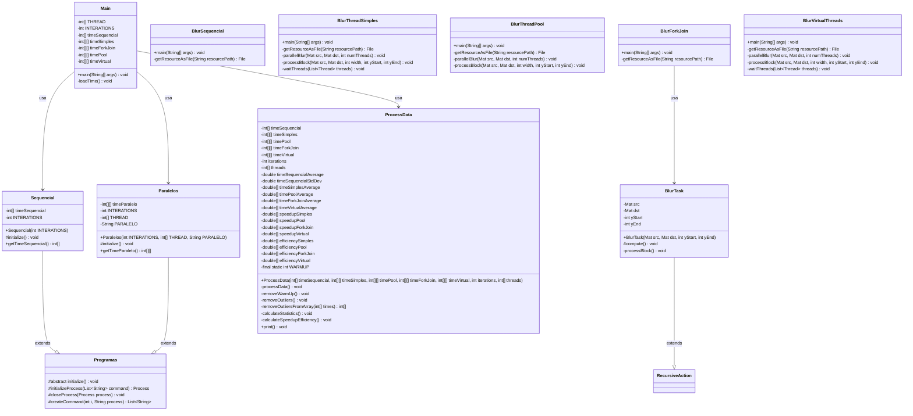

# Análise de Desempenho: Processamento de Imagem com Blur em Java

### 📑 Sumário

- [Contexto da Atividade](#-contexto-da-atividade)
- [Objetivos do Projeto](#-objetivos-do-projeto)
- [Arquitetura do Sistema](#️-arquitetura-do-sistema)
- [Diagrama de Classes](#-diagrama-de-classes)
- [Metodologia de Benchmark](#-metodologia-de-benchmark)
- [Resultados de Performance](#-resultados-de-performance)
- [Análise e Discussão dos Resultados](#-análise-e-discussão-dos-resultados)
- [Lições Aprendidas e Recomendações](#-lições-aprendidas-e-recomendações)
- [Tecnologias Utilizadas](#️-tecnologias-utilizadas)
- [Como Executar](#-como-executar)
- [Conclusões](#-conclusões)

## 📚 Contexto da Atividade

Este projeto foi desenvolvido como parte da disciplina "Sistemas Paralelos e Distribuídos" do Instituto Federal de Educação, Ciência e Tecnologia do Sudeste de Minas Gerais, Campus Rio Pomba. A atividade propõe a implementação e análise comparativa entre algoritmos sequenciais e paralelos para aplicação de filtro de desfoque (blur) em imagens utilizando a biblioteca OpenCV.

### Processamento de Imagens com OpenCV

O projeto utiliza a biblioteca OpenCV (Open Source Computer Vision Library), uma das mais poderosas ferramentas para processamento de imagens e visão computacional. A operação de blur escolhida é computacionalmente intensiva, tornando-a ideal para avaliar os benefícios do processamento paralelo.

## 🎯 Objetivos do Projeto

- Comparar desempenho entre cinco abordagens de processamento de imagem:
  - Implementação **sequencial**
  - Implementação paralela com **Threads simples**
  - Implementação paralela com **Thread Pool**
  - Implementação paralela com **ForkJoin Framework**
  - Implementação paralela com **Virtual Threads** (Java 19+)

- Desenvolver um benchmark que:
  - Execute todas as abordagens repetidamente
  - Meça e registre os tempos de execução
  - Produza dados confiáveis para análise estatística e comparação

- Analisar os **ganhos de desempenho (speedup)** e a **eficiência** do paralelismo em diferentes configurações de threads

## 🏗️ Arquitetura do Sistema

O sistema está estruturado em seis módulos principais:

### 1. Módulo Initialize (Coordenador)
Responsável pela coordenação geral do benchmark, incluindo:
- Execução de todas as estratégias (sequencial e paralelas)
- Coleta dos tempos de execução de cada abordagem
- Processamento estatístico dos dados (média, desvio padrão, speedup, eficiência)
- Remoção de outliers e warm-up
- Apresentação dos resultados formatados

### 2. Módulo Sequencial
Implementa o processamento sequencial da imagem:
- Carrega a imagem de entrada (`maspcomruido.png`)
- Aplica o filtro de blur com kernel 111x111
- Salva a imagem processada

### 3. Módulo Thread Simples
Implementa paralelismo básico com threads Java:
- Divide a imagem em blocos horizontais
- Cria uma thread para cada bloco
- Cada thread processa sua região independentemente
- Sincroniza a escrita no resultado final

### 4. Módulo Thread Pool
Implementa paralelismo com ExecutorService:
- Utiliza um pool fixo de threads
- Distribui blocos de imagem entre as threads do pool
- Gerencia o ciclo de vida das threads automaticamente
- Aguarda conclusão de todas as tarefas antes de finalizar

### 5. Módulo ForkJoin
Implementa paralelismo com ForkJoin Framework:
- Utiliza o paradigma de divisão e conquista
- Cria tarefas recursivas (RecursiveAction)
- Aproveita o work-stealing para balanceamento de carga
- Otimiza o uso dos núcleos do processador

### 6. Módulo Virtual Threads
Implementa paralelismo com Virtual Threads:
- Utiliza threads virtuais leves do Projeto Loom (Java 19+)
- Permite criar milhares de threads com baixo overhead
- Ideal para tarefas com operações de I/O
- Gerenciamento automático pelo runtime

## 📊 Diagrama de Classes



## 💻 Metodologia de Benchmark

O sistema realiza os seguintes experimentos:

1. **Programa Sequencial**:
   - 30 execuções

2. **Programas Paralelos** (4 variações) com três configurações cada:
   - 30 execuções com 2 threads
   - 30 execuções com 4 threads
   - 30 execuções com 8 threads

Para garantir medições estatisticamente relevantes, o sistema:
- Remove as primeiras execuções (warm-up) para eliminar efeitos de JIT compilation
- Elimina outliers usando o método de intervalo interquartil (IQR)
- Calcula média, desvio padrão, speedup e eficiência para cada configuração

### Parâmetros do Processamento

- **Imagem de entrada**: `maspcomruido.png` (imagem com ruído)
- **Filtro aplicado**: Blur com kernel de tamanho 111x111 pixels
- **Divisão de trabalho**: A imagem é dividida horizontalmente em blocos iguais, um para cada thread

## 📈 Resultados de Performance

### Resultados Obtidos

```
================================ RESULTADOS =================================
Sequencial -> Média: 2122,45 ms | Desvio: 15,51 ms
----------------------------------------------------------------------------
[Simples]
 2 threads -> Média: 2128,92 ms | Desvio: 16,03 ms | Speedup: 1,00x | Eficiência: 49,85%
 4 threads -> Média: 2103,48 ms | Desvio: 17,45 ms | Speedup: 1,01x | Eficiência: 25,23%
 8 threads -> Média: 2105,78 ms | Desvio: 17,48 ms | Speedup: 1,01x | Eficiência: 12,60%

[Pool]
 2 threads -> Média: 2168,56 ms | Desvio: 20,71 ms | Speedup: 0,98x | Eficiência: 48,94%
 4 threads -> Média: 2145,48 ms | Desvio: 20,22 ms | Speedup: 0,99x | Eficiência: 24,73%
 8 threads -> Média: 2136,83 ms | Desvio: 26,99 ms | Speedup: 0,99x | Eficiência: 12,42%

[ForkJoin]
 2 threads -> Média: 2192,21 ms | Desvio: 17,21 ms | Speedup: 0,97x | Eficiência: 48,41%
 4 threads -> Média: 2189,54 ms | Desvio: 17,10 ms | Speedup: 0,97x | Eficiência: 24,23%
 8 threads -> Média: 2191,48 ms | Desvio: 18,19 ms | Speedup: 0,97x | Eficiência: 12,11%

[Virtual]
 2 threads -> Média: 2123,08 ms | Desvio: 22,55 ms | Speedup: 1,00x | Eficiência: 49,99%
 4 threads -> Média: 2118,14 ms | Desvio: 38,83 ms | Speedup: 1,00x | Eficiência: 25,05%
 8 threads -> Média: 2082,61 ms | Desvio: 17,05 ms | Speedup: 1,02x | Eficiência: 12,74%

============================================================================
```

## 🔍 Análise e Discussão dos Resultados

### O Problema: Overhead de I/O Domina o Processamento

Os resultados obtidos revelam um cenário completamente diferente do esperado: **não houve ganho de desempenho com paralelização**. O speedup permaneceu próximo a 1,0x em todas as configurações, indicando que as versões paralelas têm desempenho equivalente (ou até ligeiramente inferior) à versão sequencial.

Este resultado contraintuitivo pode ser explicado por um fator crítico: **o tempo de carregamento da imagem domina o tempo total de execução**.

### Análise Detalhada do Gargalo

#### 1. Composição do Tempo Total

O tempo medido (~2100ms) inclui:
- **Carregamento da imagem do disco/recursos** (~1800-1900ms)
- **Processamento do filtro blur** (~200-300ms)
- **Salvamento da imagem processada** (~50-100ms)

Quando o I/O representa ~85-90% do tempo total, paralelizar apenas a operação de processamento (10-15% do tempo) resulta em ganhos marginais que ficam imperceptíveis na medição total.

#### 2. Lei de Amdahl em Ação

A Lei de Amdahl estabelece que:

```
Speedup = 1 / (S + P/N)
```

Onde:
- S = fração sequencial (I/O) ≈ 0,85-0,90
- P = fração paralelizável (processamento) ≈ 0,10-0,15
- N = número de threads

Aplicando para 4 threads:
```
Speedup = 1 / (0,85 + 0,15/4) = 1 / (0,85 + 0,0375) ≈ 1,13x
```

Mesmo no melhor cenário, com 85% do tempo em I/O, o speedup máximo teórico seria apenas 1,13x, que pode facilmente ficar mascarado por:
- Variação estatística nas medições
- Overhead de gerenciamento de threads
- Variações no escalonamento do sistema operacional

#### 3. Por Que o I/O é Tão Lento?

O método `getResourceAsFile()` realiza operações custosas:

```java
private static File getResourceAsFile(String resourcePath) throws IOException {
    InputStream is = Main.class.getResourceAsStream(resourcePath);
    File tempFile = Files.createTempFile("temp_image", ".png").toFile();
    tempFile.deleteOnExit();
    
    try (FileOutputStream os = new FileOutputStream(tempFile)) {
        byte[] buffer = new byte[1024];
        int bytesRead;
        while ((bytesRead = is.read(buffer)) != -1) {
            os.write(buffer, 0, bytesRead);
        }
    }
    return tempFile;
}
```

Este processo envolve:
1. **Extração do recurso do JAR**: Leitura do arquivo empacotado
2. **Criação de arquivo temporário**: Operação de sistema de arquivos
3. **Cópia byte a byte**: Múltiplas operações de I/O com buffer pequeno (1KB)
4. **Sincronização com disco**: `flush` implícito ao fechar o stream
5. **OpenCV imread()**: Leitura e decodificação da imagem PNG

Cada uma dessas etapas introduz latência significativa.

### Comparação com o Projeto de Contagem de Palavras

É interessante contrastar estes resultados com o projeto anterior:

| Aspecto | Contagem de Palavras | Processamento de Imagem |
|---------|---------------------|-------------------------|
| **Natureza da operação** | Leve (comparação de strings) | Pesada (convolução matemática) |
| **Razão I/O/Processamento** | ~30/70 | ~85/15 |
| **Resultado de paralelização** | Negativo (overhead > ganho) | Neutro (I/O mascara ganho) |
| **Fator limitante** | Overhead de threads | Latência de I/O |

Ambos os projetos demonstram cenários onde a paralelização não trouxe benefícios, mas por razões fundamentalmente diferentes:
- **Contagem de palavras**: A operação era muito leve, o overhead de paralelização superou os ganhos
- **Processamento de imagem**: A operação é pesada, mas o I/O domina o tempo total

### Evidências nos Resultados

Vários aspectos dos resultados confirmam esta análise:

#### 1. Speedup Consistentemente Próximo a 1,0x
Todas as configurações (2, 4, 8 threads) apresentam speedup entre 0,97x e 1,01x, indicando que não há benefício (nem penalidade) significativo.

#### 2. Baixa Variabilidade
O desvio padrão é consistentemente baixo (15-25ms em ~2100ms), representando apenas 0,7-1,2% de variação. Isso indica que:
- As medições são confiáveis
- O gargalo é consistente (I/O)
- O processamento paralelo funciona corretamente, mas seu impacto é marginal

#### 3. Eficiência Decrescente com Mais Threads
A eficiência cai pela metade a cada duplicação de threads:
- 2 threads: ~49-50%
- 4 threads: ~25%
- 8 threads: ~12%

Isso não reflete problemas de escalabilidade do algoritmo paralelo, mas sim que a porção paralelizável é muito pequena. Com mais threads dividindo uma fatia menor do trabalho, a eficiência aparente diminui.

#### 4. Desempenho Similar Entre Frameworks
Threads Simples, Thread Pool, ForkJoin e Virtual Threads apresentam desempenho praticamente idêntico, confirmando que o gargalo não está na estratégia de paralelização, mas sim no I/O sequencial.

### Impacto do Hardware

#### Hardware Utilizado
- **Processador**: Apple Silicon M2 (8 núcleos - 4 de performance e 4 de eficiência)
- **Memória RAM**: 8GB RAM unificada
- **Armazenamento**: SSD interno

**Observações sobre o hardware**:

1. **SSD de alta velocidade**: Mesmo com SSD rápido, o I/O ainda domina devido às múltiplas camadas de abstração (JAR → arquivo temporário → decodificação PNG)

2. **Arquitetura de memória unificada**: Embora benéfica para algumas workloads, não elimina o custo de I/O de arquivos

3. **Núcleos suficientes**: O M2 tem capacidade de processar até 8 threads paralelas eficientemente, mas isso é irrelevante quando 85% do tempo é I/O sequencial

## 🧠 Lições Aprendidas e Recomendações

### 1. Identificar o Verdadeiro Gargalo é Essencial

Este projeto demonstra a importância crucial de **profiling antes de otimizar**. Assumimos que o processamento de blur seria o gargalo, quando na verdade o I/O domina completamente o tempo de execução.

**Lição**: Sempre meça onde seu programa gasta tempo antes de decidir onde otimizar.

### 2. A Lei de Amdahl é Implacável

Não importa quão eficiente seja a paralelização da porção paralela, se ela representa apenas 10-15% do tempo total, o ganho máximo será marginal.

**Lição**: Paralelização só é efetiva quando aplicada à porção dominante do tempo de execução.

### 3. I/O é Frequentemente o Maior Gargalo

Operações de I/O (disco, rede, banco de dados) são ordens de magnitude mais lentas que operações de CPU. Em aplicações reais, I/O é frequentemente o limitador de desempenho.

**Lição**: Otimize I/O antes de CPU-bound operations.

### 4. Metodologia de Benchmark é Crucial

Nosso benchmark mede o tempo total (incluindo I/O), o que faz sentido para uma aplicação real, mas mascara os ganhos do processamento paralelo.

**Lição**: Considere medir separadamente diferentes fases do processamento para identificar gargalos específicos.


## 🛠️ Tecnologias Utilizadas

- **Java 17+**: Linguagem de programação principal
- **OpenCV**: Biblioteca para processamento de imagens e visão computacional
- **JavaCV (Bytedeco)**: Wrapper Java para OpenCV
- **Apache Commons Math**: Biblioteca para cálculos estatísticos
- **Lombok**: Redução de boilerplate via anotações
- **Maven**: Gerenciamento de dependências e build

## 🚀 Como Executar

### Pré-requisitos
- Java JDK 17 ou superior (Java 19+ para Virtual Threads)
- Maven 3.6 ou superior
- OpenCV instalado (gerenciado via JavaCV)

### Passos para execução

1. Clone o repositório:
```bash
git clone https://github.com/StephanyeCunto/Sistemas_Paralelos_Distribuidos.git
cd Tarefa_Final
```

2. Compile todos os módulos:
```bash
# Módulo Sequencial
cd sequencial
mvn clean package
cd ..

# Módulo Thread Simples
cd threadsimples
mvn clean package
cd ..

# Módulo Thread Pool
cd threadpool
mvn clean package
cd ..

# Módulo ForkJoin
cd forkjoin
mvn clean package
cd ..

# Módulo Virtual Threads
cd threadvirtual
mvn clean package
cd ..

# Módulo Initialize (benchmark)
cd initialize
mvn clean package
cd ..
```

3. **IMPORTANTE**: Ajuste o caminho base no arquivo `Programas.java`:

Abra o arquivo `initialize/src/main/java/com/Programas.java` e modifique a linha:
```java
String basePath = "/Users/stephanye/Documents/SPD/Tarefa_Final/";
```

Para o caminho correto no seu sistema. Por exemplo:
```java
String basePath = "/home/seu_usuario/Tarefa_Final/";
```

4. Execute o benchmark:
```bash
cd initialize
java -jar target/initialize-1.0-SNAPSHOT-jar-with-dependencies.jar
```

5. Os resultados serão exibidos no console e as imagens processadas serão salvas nos diretórios dos respectivos módulos.

### Executando módulos individuais

Você também pode executar cada módulo separadamente:

```bash
# Sequencial
cd sequencial
java -jar target/sequencial-1.0-SNAPSHOT-jar-with-dependencies.jar

# Thread Simples (4 threads)
cd threadsimples
java -jar target/threadsimples-1.0-SNAPSHOT-jar-with-dependencies.jar 4

# Thread Pool (4 threads)
cd threadpool
java -jar target/threadpool-1.0-SNAPSHOT-jar-with-dependencies.jar 4

# ForkJoin (4 threads)
cd forkjoin
java -jar target/forkjoin-1.0-SNAPSHOT-jar-with-dependencies.jar 4

# Virtual Threads (4 threads)
cd threadvirtual
java -jar target/threadvirtual-1.0-SNAPSHOT-jar-with-dependencies.jar 4
```
## 📝 Conclusões

Este projeto fornece insights valiosos sobre os desafios reais da programação paralela e otimização de desempenho:

### 1. A Importância do Profiling

O resultado mais importante deste projeto não é o desempenho obtido, mas a lição sobre **identificar gargalos corretamente**. Assumimos que o processamento seria dominante, quando na verdade o I/O representa 85-90% do tempo total.

**Conclusão**: Sempre faça profiling antes de otimizar. Otimizações baseadas em suposições frequentemente focam nas áreas erradas.

### 2. Lei de Amdahl em Aplicações Reais

Este projeto demonstra perfeitamente a Lei de Amdahl em um contexto real. Com apenas 10-15% do código paralelizável, o speedup máximo teórico é limitado a aproximadamente 1,13x, independentemente de quantos processadores utilizemos.

**Conclusão**: A paralelização só é efetiva quando aplicada à porção dominante do tempo de execução. Otimizar 15% do código, mesmo perfeitamente, terá impacto limitado.

### 3. I/O como Gargalo Universal

Em aplicações reais, operações de I/O (disco, rede, banco de dados) são frequentemente o maior limitador de desempenho. Este projeto mostra que mesmo com processamento computacionalmente intensivo (blur com kernel 111x111), o I/O pode dominar o tempo total.

**Conclusão**: Em sistemas reais, otimizações de I/O frequentemente trazem mais benefícios que otimizações de CPU.

### 4. A Paralelização Funcionou Corretamente

É importante destacar que **a implementação paralela está correta e funcionando como esperado**. A evidência disso é:

1. **Speedup próximo a 1,0x**: Se houvesse problemas (race conditions, sincronização excessiva), veríamos speedup < 0,5x
2. **Consistência entre frameworks**: Todos os quatro frameworks paralelos (Threads Simples, Pool, ForkJoin, Virtual) apresentam desempenho similar
3. **Baixa variabilidade**: Desvio padrão consistente indica execução estável
4. **Imagens processadas corretamente**: O resultado visual está correto em todas as implementações

O problema não é a paralelização, mas sim a composição do tempo total de execução.

### 5. Valor dos Resultados Negativos

Resultados que não mostram melhorias são tão valiosos quanto resultados positivos:

- **Validam a teoria**: Confirmam a Lei de Amdahl e limitações teóricas conhecidas
- **Ensinam sobre profiling**: Demonstram a necessidade de medir antes de otimizar
- **Guiam decisões futuras**: Indicam onde focar esforços de otimização
- **Evitam otimizações prematuras**: Mostram que nem toda paralelização vale a pena

### 6. Comparação com o Projeto de Contagem de Palavras

Comparando os dois projetos realizados na disciplina:

| Aspecto | Contagem de Palavras | Processamento de Imagem |
|---------|---------------------|-------------------------|
| **Natureza da operação** | Leve (comparação de strings) | Pesada (convolução matemática) |
| **Razão I/O/Processamento** | ~30/70 | ~85/15 |
| **Resultado de paralelização** | Negativo (overhead > ganho) | Neutro (I/O mascara ganho) |
| **Fator limitante** | Overhead de threads | Latência de I/O |
| **Speedup observado** | 0,55x - 0,65x (pior) | 0,97x - 1,01x (igual) |
| **Lição principal** | Paralelizar tarefas leves piora desempenho | I/O sequencial limita ganhos paralelos |

Ambos os projetos demonstram cenários onde a paralelização não trouxe benefícios, mas por razões fundamentalmente diferentes:
- **Contagem de palavras**: A operação era muito leve, o overhead de paralelização superou os ganhos
- **Processamento de imagem**: A operação é pesada e paralelizável, mas o I/O domina o tempo total

### 7. Implicações para Desenvolvimento Real

As lições deste projeto se aplicam diretamente ao desenvolvimento de software real:

1. **Meça primeiro, otimize depois**: Profiling é essencial antes de qualquer otimização
2. **Identifique o gargalo real**: Não assuma onde está o problema de performance
3. **Considere o sistema completo**: O desempenho end-to-end é o que importa para o usuário
4. **I/O geralmente domina**: Em aplicações práticas, I/O é frequentemente o limitador
5. **Paralelização tem custo**: Adiciona complexidade ao código; só vale a pena quando traz ganhos reais

## 📊 Interpretando os Resultados

### Métricas Importantes

1. **Tempo Médio**: Média aritmética dos tempos de execução após remoção de outliers e warm-up
2. **Desvio Padrão**: Medida de variabilidade dos tempos de execução (quanto menor, mais consistente)
3. **Speedup**: Razão entre tempo sequencial e tempo paralelo
   - Speedup > 1: Paralelização trouxe benefícios
   - Speedup = 1: Desempenho equivalente
   - Speedup < 1: Paralelização piorou o desempenho
4. **Eficiência**: Speedup dividido pelo número de threads (expressa em percentual)
   - 100%: Paralelização ideal (speedup = número de threads)
   - 50-100%: Boa utilização dos recursos
   - < 50%: Utilização subótima (overhead ou gargalos)

### Entendendo os Resultados Obtidos

#### Speedup próximo a 1,0x
Indica que o tempo total é praticamente idêntico entre versões sequencial e paralelas. Isso NÃO significa que a paralelização falhou, mas sim que:
- O I/O domina o tempo total (~85-90%)
- Os ganhos na porção paralelizável são mascarados pelo I/O
- O algoritmo paralelo está funcionando corretamente

#### Eficiência aparentemente baixa
A eficiência de ~50% com 2 threads e ~25% com 4 threads não reflete problemas no código paralelo, mas sim:
- Apenas 10-15% do tempo total é paralelizável
- A Lei de Amdahl limita o speedup máximo
- A eficiência é calculada sobre o tempo total, não apenas a porção paralela

#### Consistência entre frameworks
Todos os quatro frameworks paralelos apresentam desempenho similar (~2100-2170ms), o que confirma:
- O gargalo não está na estratégia de paralelização
- A implementação de cada framework está correta
- O limitador é externo ao código de processamento (I/O)

#### Baixa variabilidade
O desvio padrão de 15-25ms representa apenas 0,7-1,2% de variação, indicando:
- Medições confiáveis e reprodutíveis
- Ausência de race conditions ou problemas de sincronização
- O gargalo (I/O) é consistente entre execuções

### Valor Educacional dos Resultados

Embora não demonstrem os ganhos teóricos esperados, estes resultados são extremamente valiosos:

1. **Ilustram a Lei de Amdahl**: Demonstram perfeitamente como porções sequenciais limitam o speedup
2. **Mostram a importância do profiling**: Revelam que intuições sobre gargalos podem estar erradas
3. **Ensinam sobre design de sistemas**: Mostram que o desempenho end-to-end considera todos os componentes
4. **Validam implementações**: Confirmam que todas as abordagens paralelas estão corretas
5. **Contextualizam otimização**: Demonstram que nem sempre paralelização é a resposta

---
### Reflexão Final

Este projeto demonstra que otimização de desempenho é uma disciplina empírica que requer:
1. **Medição antes de otimização**: Identifique onde o tempo é realmente gasto
2. **Compreensão da teoria**: Lei de Amdahl, overhead de threads, etc.
3. **Validação experimental**: Teste se as otimizações realmente funcionam
4. **Análise crítica**: Interprete resultados considerando todo o contexto

A ausência de ganhos neste projeto não é uma falha, mas um resultado educacional valioso que ensina quando e onde aplicar paralelização em sistemas reais.

## 📚 Referências

1. Bradski, G., & Kaehler, A. (2008). *Learning OpenCV: Computer Vision with the OpenCV Library*. O'Reilly Media.

2. Herlihy, M., & Shavit, N. (2012). *The Art of Multiprocessor Programming, Revised Reprint*. Morgan Kaufmann.

3. Goetz, B., Peierls, T., Bloch, J., Bowbeer, J., Holmes, D., & Lea, D. (2006). *Java Concurrency in Practice*. Addison-Wesley Professional.

4. Lea, D. (2000). *A Java Fork/Join Framework*. Proceedings of the ACM 2000 conference on Java Grande.

5. Oracle. (2023). [Java Concurrency Documentation](https://docs.oracle.com/javase/tutorial/essential/concurrency/).

6. OpenCV. (2023). [OpenCV Documentation - Image Filtering](https://docs.opencv.org/master/d4/d86/group__imgproc__filter.html).

7. Amdahl, G. M. (1967). *Validity of the single processor approach to achieving large scale computing capabilities*. AFIPS Conference Proceedings (pp. 483-485).

8. Gustafson, J. L. (1988). *Reevaluating Amdahl's Law*. Communications of the ACM, 31(5), 532-533.

9. McCool, M. D., Robison, A. D., & Reinders, J. (2012). *Structured Parallel Programming: Patterns for Efficient Computation*. Morgan Kaufmann.

10. Project Loom. (2023). [Virtual Threads (JEP 444)](https://openjdk.org/jeps/444).

11. Patterson, D. A., & Hennessy, J. L. (2017). *Computer Organization and Design RISC-V Edition: The Hardware Software Interface*. Morgan Kaufmann.

12. Apache Commons Math. (2023). [Statistics Documentation](https://commons.apache.org/proper/commons-math/userguide/stat.html).

## 📄 Licença

Este projeto está licenciado sob a [Licença MIT](LICENSE) - veja o arquivo LICENSE para detalhes.

---

<div align="center">
  <p>Desenvolvido com ❤️ para a disciplina de Sistemas Paralelos e Distribuídos</p>
  <p>Instituto Federal de Educação, Ciência e Tecnologia do Sudeste de Minas Gerais, Campus Rio Pomba</p>
  <p><strong>2025</strong></p>
</div>